<!-- ANIMATED HEADER BANNER -->

<!-- TYPING ANIMATION -->

 

<!-- PROFILE VIEWS + FOLLOWERS BADGES -->

---

## 🧠 About Me

- 🎓 **First Year AI/ML Engineering Student** at Lovely Professional University, Punjab 🇮🇳
- 🔭 Currently building **BloomNet** — a geo-coordinated food donation platform 🌸
- 🌱 Learning: **Python · C · DBMS · Machine Learning**
- 💬 Ask me about: **Python, HTML, JavaScript, Pygame**
- 🤝 Open to contributing to beginner-friendly open source projects
- ⚡ Fun fact: I built a Flappy Bird clone before writing my first ML model 🎮
- 📫 Reach me: **vajpairajvardhan6@gmail.com**
## 🛠 Tech Stack

**Languages**

**Data & ML**

**Databases**

**Tools**

---

## 📊 GitHub Stats

---

## 🏆 GitHub Trophies

---

## 📌 Featured Projects

---

## 📈 Contribution Activity

---

## 🐍 Contribution Snake

<picture>
  <source media="(prefers-color-scheme: dark)" srcset="https://github.com/Rajvardhan-Vajpai/Rajvardhan-Vajpai/raw/output/github-contribution-grid-snake-dark.svg" />
  <source media="(prefers-color-scheme: light)" srcset="https://github.com/Rajvardhan-Vajpai/Rajvardhan-Vajpai/raw/output/github-contribution-grid-snake.svg" />
  
</picture>

---

## 🤝 Connect with Me

---

<!-- FOOTER WAVE -->

*"The best way to predict the future is to build it." — Alan Kay*

